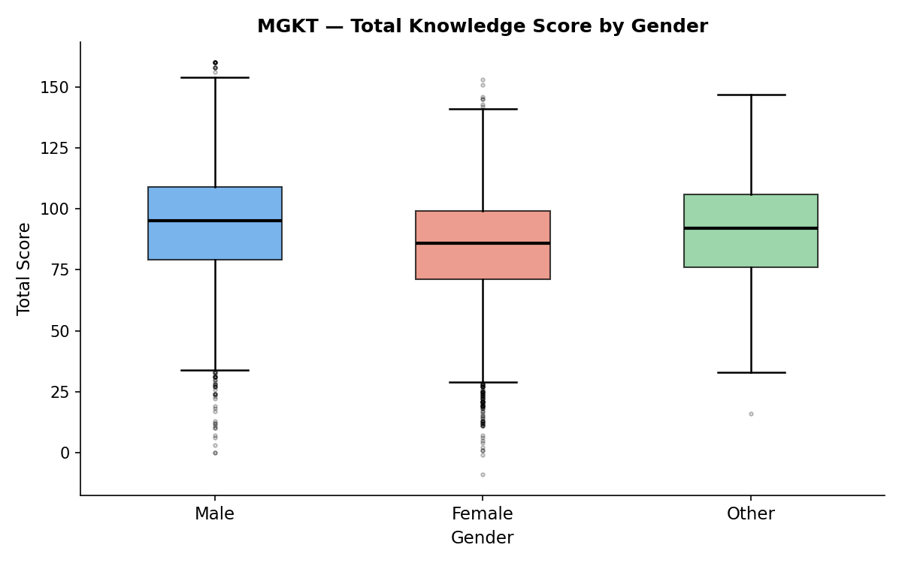

# MGKT Mini Explorer

> **Who knows what — and does it vary by gender or age?**
> A reproducible exploratory analysis of the Multi-Factor General Knowledge Test dataset (n ≈ 19 k, collected 2017–2018).

## Live Demo

[GitHub Pages](https://SuperCandy611.github.io/MGKT-mini-explorer/)

---

## Screenshot



*Figure: Distribution of total knowledge score (correct − incorrect across 32 questions) broken down by gender. Males score slightly higher at the median, but all groups show wide individual variation.*

---

## Motivation

The **Open-Source Psychometrics Project** releases anonymised cognitive-test datasets that are rare in being both large-scale and freely available. I chose the MGKT because it covers 32 heterogeneous knowledge domains — from geography and science to pop culture — making it possible to ask:

- **What does the overall score distribution look like?** (Is general knowledge roughly bell-shaped, or skewed?)
- **Does score differ systematically by gender?** (And by how much, relative to within-group spread?)

These questions are answered visually in `notebooks/01_explore.ipynb` using only pandas and matplotlib, keeping the pipeline fully reproducible without proprietary tools.

---

## How to Run

```bash
# 1. Clone
git clone https://github.com/SuperCandy611/MGKT-mini-explorer.git
cd MGKT-mini-explorer

# 2. Create & activate virtual environment
python -m venv .venv
# Windows
.venv\Scripts\activate
# macOS / Linux
source .venv/bin/activate

# 3. Install dependencies
pip install -r requirements.txt

# 4. Download & place the raw data  (excluded from git)
#    Download: https://openpsychometrics.org/_rawdata/MGKT_data.zip
#    Unzip and move the CSV so the path is:
#      data/raw/data.csv

# 5. Launch the analysis notebook
jupyter notebook notebooks/01_explore.ipynb
```

Running all cells will reproduce the two figures saved in `reports/`.

---

## Project Structure

```
MGKT-mini-explorer/
├── data/
│   └── raw/
│       ├── data.csv          ← NOT in git — download above
│       └── codebook.txt      ← variable descriptions
├── notebooks/
│   ├── 01_explore.ipynb      ← main analysis (Fig 1 & Fig 2)
│   ├── style_a_oneliner.ipynb
│   ├── style_b_specification.ipynb
│   └── style_c_planfirst.ipynb
├── reports/                  ← generated figures (committed)
│   ├── fig1_score_distribution.png
│   └── fig2_score_by_gender.png
├── src/
│   └── load_data.py          ← load_clean_data() helper module
├── docs/                     ← GitHub Pages source (if enabled)
└── requirements.txt
```

---

## Prompt Style Comparison

| Style | 產出能直接跑嗎？ | 程式碼可讀性 | 防呆程度（處理 edge case） | 你下次會選哪個？為什麼？ |
|-------|----------------|------------|--------------------------|------------------------|
| A. One-liner | 可以 | 偏高，有分區說明用途 | 有自動處理不合理值，雖然很寬鬆 | |
| B. Specification | 可以 | 高，易懂，看得出回應我的哪個步驟 | 完全符合我的要求去處理 | 選這個，因為完全回應需要。但需要我自己有概念。在那之前可能選 C。 |
| C. Plan-first | 可以 | 高，確實符合我的要求，但比較不直接應對我的需要 | 比較漂亮有條理，同樣有效 | |

---

## Data Source & License

- **Dataset:** [MGKT_data.zip](https://openpsychometrics.org/_rawdata/MGKT_data.zip)
- **Source:** [Open-Source Psychometrics Project](https://openpsychometrics.org/)
- The dataset is made publicly available for research and educational use by the Open-Source Psychometrics Project. Please credit the source if you use it in your own work.

---

## Author

**Candy Wu**
Student ID: 113892001
NCU 認知神經科學研究所 博士二年級

*Code in this repository was developed with assistance from [Claude](https://claude.ai) (Anthropic).*
